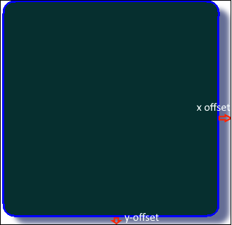

# Shadow detection

## 1.Introduction
This repository is for Sofware Engineering(extra) assignment. The requirement is to detect shadow offset of a web component like button, div...  



There are 2 main steps in order to detect shadow:
1. Detect components on a web page
2. Take images labeled "button" from previous step and detect shadow on it
## 2. Component detection
Install dependency:
```
pip install pyyaml==5.1
```

Install **torch**, there are 2 options: CPU and GPU:
```
% For torch+GPU version
pip install torch==1.8.0+cu111 torchvision==0.9.0+cu111 torchaudio==0.8.0 -f https://download.pytorch.org/whl/torch_stable.html
% For torch+CPU version
pip install torch==1.8.0 torchvision==0.9.0+cu111 torchaudio==0.8.0 -f https://download.pytorch.org/whl/torch_stable.html
```
Then, we can install **detectron2**
```
% For torch+GPU version
pip install detectron2 -f https://dl.fbaipublicfiles.com/detectron2/wheels/cu111/torch1.8/index.html
% For torch+CPU version
pip install detectron2 -f https://dl.fbaipublicfiles.com/detectron2/wheels/cpu/torch1.8/index.html
```
You should check whether detectron2 work properly
```
python3 -c "import detectron2"
```

For more information about installation, visit [this link](https://detectron2.readthedocs.io/en/latest/tutorials/install.html).

Download the model file that I trained previously:
```
pip3 install gdown
mkdir Component-Detection/faster_rcnn_R_50_FPN_3x
gdown https://drive.google.com/uc?export=download&id=1GVdo4174Mn-8wuLFRbVGng3RA4hZ4IEC -O Component-Detection/faster_rcnn_R_50_FPN_3x/model_final.path
```
Training process uses [this dataset](https://public.roboflow.com/object-detection/website-screenshots)

Put your image into Component-Detection/input folder, then run the command:
```
cd Component-Detection
python3 component-detection.py --input <you-image-name>
```
Output will be at Component-Detection/ouput folder:

* All detected components: \<your-image-name\>-output.\<format\>
* Button only: \<your-image-name\>-button.\<format\>
* Cropped boxes folder: output/\<your-image-name\>/

Example with input image **abc.png**:
* All components detected: **output/abc-output.png**
* Button only: **output/abc-button.png**
* Cropped boxes folder: **output/abc/**

Back to root folder:
`
cd ../
`
## 3 Shadow detection
Put your output folder containing button images from previous step to Shadow-Detection/input folder.

```
cd Shadow-Detection
cp -r ../Component-Detection/output/<folder-name> input/ 
```

Then run the following command:

```
python3 shadow-detection.py --folder <folder-name>
```
Result will be located in **debug** folder.
